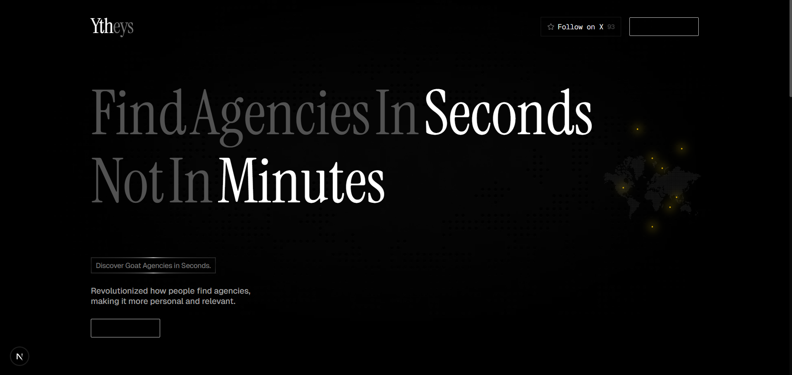
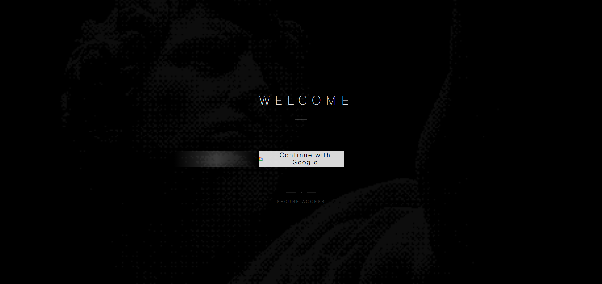
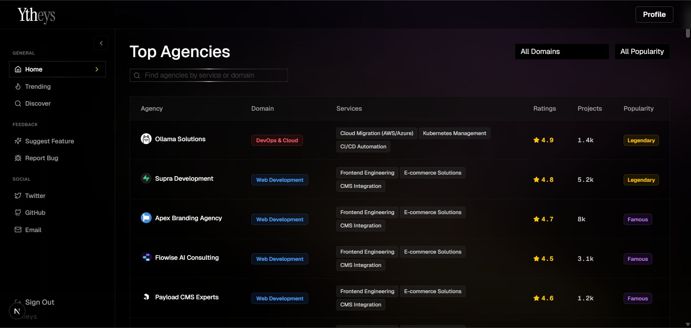
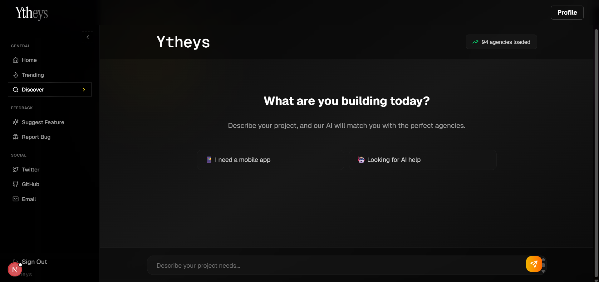

# Ytheys ImpactNexus

A Next.js web application built with [Tailwind CSS](https://tailwindcss.com/) and powered by [Drizzle ORM](https://orm.drizzle.team/) & [Better Auth](https://better-auth.com/).

## Prerequisites

Before you begin, ensure you have the following installed:
- [Node.js](https://nodejs.org/) (v18 or higher recommended)
- [npm](https://www.npmjs.com/) (or [Bun](https://bun.sh/) / pnpm / yarn)
- A PostgreSQL database (e.g., [Supabase](https://supabase.com/), [Neon](https://neon.tech/), or local PostgreSQL)

## Getting Started

Follow these steps to set up the project locally:

### 1. Clone the repository
```bash
git clone https://github.com/SandeepNaidu228/Ytheys_ImpactNexus.git
cd Ytheys_ImpactNexus
```

### 2. Install dependencies
Using npm (or your preferred package manager):
```bash
npm install
# or bun install
```

### 3. Environment Variables Setup
Copy the example environment file to create your own configuration:
```bash
cp .env.example .env
```
Open the `.env` file and fill in the required values:
- `DATABASE_URL`: Add your PostgreSQL connection string. Ensure the host, username, and password are correct.
- `BETTER_AUTH_SECRET`: A secure random string for authentication. You can generate one using `openssl rand -base64 32` or similar.
- Update any other API keys or URLs based on your environment.

### 4. Database Initialization
Ensure your database is running and the connection string is valid. Then, push the schema to your database using Drizzle ORM:
```bash
npx drizzle-kit push
```
*(Alternatively, you can generate and run migrations if you use a migration-based workflow with `npx drizzle-kit generate` and `npx drizzle-kit migrate`).*

### 5. Run the Development Server
Start the development server:
```bash
npm run dev
# or bun run dev
```

Open [http://localhost:3000](http://localhost:3000) with your browser to see the result.


## Output Screenshots

Here are previews showcasing the application's interface:

### Landing Page / Overview


### Authentication / Login Page


### Home Page


### Discover Page



---

Feel free to open an issue or submit a pull request if you encounter any problems!
